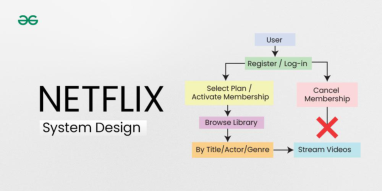
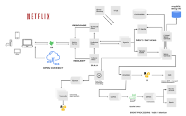
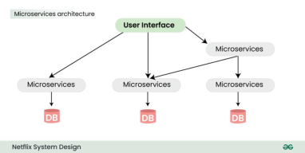
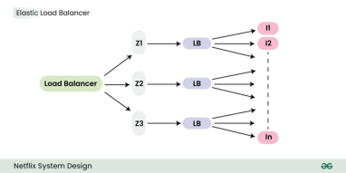
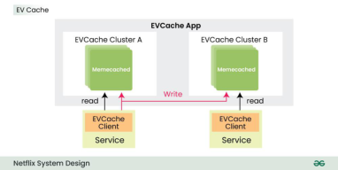

# System Design Netflix | A Complete Architecture

Last Updated : 01 Apr, 2024

Designing Netflix is a quite common question of system design rounds in interviews.

In the world of streaming services, Netflix stands as a monopoly, captivating millions

of viewers worldwide with its vast library of content delivered seamlessly to screens

of all sizes. Behind this seemingly effortless experience lies a nicely crafted system

design. In this article, we will study Netflix’s system design.

### Important Topics for the Netflix System Design
        
Requirements of Netflix System Design

High-Level Design of Netflix System Design

Microservices Architecture of Netflix

Low Level Design of Netflix System Design

How Does Netflix Onboard a Movie/Video?

How Netflix balance the high traffic load

EV Cache

Data Processing in Netflix Using Kafka And Apache Chukwa

Elastic Search

Apache Spark For Movie Recommendation

Database Design of Netflix System Design

## 1. Requirements of Netflix System Design

1.1. Functional Requirements

Users should be able to create accounts, log in, and log out.

Subscription management for users.

-----

functionalities.

Ability to download content for offline viewing.

Personalized content recommendations based on user preferences and viewing

history.

1.2. Non-Functional Requirements

Low latency and high responsiveness during content playback.

Scalability to handle a large number of concurrent users.

High availability with minimal downtime.

Secure user authentication and authorization.

Intuitive user interface for easy navigation.

## 2. High-Level Design of Netflix System Design

We all are familiar with Netflix services. It handles large categories of movies and

television content and users pay the monthly rent to access these contents. Netflix

has 180M+ subscribers in 200+ countries.

Netflix works on two clouds AWS and Open Connect. These two clouds work

together as the backbone of Netflix and both are highly responsible for providing the

best video to the subscribers.

The application has mainly 3 components:

Client:

Device (User Interface) which is used to browse and play Netflix videos.

TV, XBOX, laptop or mobile phone, etc

OC (Open Connect) or Netflix CDN:

CDN is the network of distributed servers in different geographical

locations, and Open Connect is Netflix’s own custom global CDN (Content

delivery network).

-----

It is distributed in different locations and once you hit the play button the

video stream from this component is displayed on your device.

So if you’re trying to play the video sitting in North America, the video will

be served from the nearest open connect (or server) instead of the original

server (faster response from the nearest server).

Backend (Database):

This part handles everything that doesn’t involve video streaming (before

you hit the play button) such as onboarding new content, processing

videos, distributing them to servers located in different parts of the world,

and managing the network traffic.

Most of the processes are taken care of by Amazon Web Services.

## 2.1. Microservices Architecture of Netflix

Netflix’s architectural style is built as a collection of services. This is known as

microservices architecture and this power all of the APIs needed for applications and

Web apps. When the request arrives at the endpoint it calls the other microservices

for required data and these microservices can also request the data from different

microservices. After that, a complete response for the API request is sent back to the

endpoint.

In a microservice architecture, services should be independent of each other. For

example, The video storage service would be decoupled from the service responsible

for transcoding videos.

How to make microservice architecture reliable?

Use Hystrix (Already explained above)

Separate Critical Microservices:

We can separate out some critical services (or endpoint or APIs) and make

-----

services.

While choosing the critical microservices you can include all the basic

functionalities, like searching for a video, navigating to the videos, hitting

and playing the video, etc.

This way you can make the endpoints highly available and even in worst-

case scenarios at least a user will be able to do the basic things.

Treat Servers as Stateless:

To understand this concept think of your servers like a herd of cows and

you care about how many gallons of milk you get every day.

If one day you notice that you’re getting less milk from a cow then you just

need to replace that cow (producing less milk) with another cow.

You don’t need to be dependent on a specific cow to get the required

amount of milk. We can relate the above example to our application.

The idea is to design the service in such a way that if one of the endpoints

is giving the error or if it’s not serving the request in a timely fashion then

you can switch to another server and get your work done.

## 3. Low Level Design of Netflix System Design

 3.1. How Does Netflix Onboard a Movie/Video?

Netflix receives very high-quality videos and content from the production houses, so

before serving the videos to the users it does some preprocessing.

Netflix supports more than 2200 devices and each one of them requires different

resolutions and formats.

To make the videos viewable on different devices, Netflix performs transcoding or

encoding, which involves finding errors and converting the original video into

different formats and resolutions.

-----

Netflix also creates file optimization for different network speeds. The quality of

a video is good when you’re watching the video at high network speed. Netflix

creates multiple replicas (approx 1100-1200) for the same movie with different

resolutions.

These replicas require a lot of transcoding and preprocessing. Netflix breaks the

original video into different smaller chunks and using parallel workers in AWS it

converts these chunks into different formats (like mp4, 3gp, etc) across different

resolutions (like 4k, 1080p, and more). After transcoding, once we have multiple

copies of the files for the same movie, these files are transferred to each and every

Open Connect server which is placed in different locations across the world.

Below is the step by step process of how Netflix ensures optimal streaming quality:

When the user loads the Netflix app on his/her device firstly AWS instances come

into the picture and handle some tasks such as login, recommendations, search,

user history, the home page, billing, customer support, etc.

After that, when the user hits the play button on a video, Netflix analyzes the

network speed or connection stability, and then it figures out the best Open

Connect server near to the user.

Depending on the device and screen size, the right video format is streamed into

the user’s device. While watching a video, you might have noticed that the video

appears pixelated and snaps back to HD after a while.

This happens because the application keeps checking the best streaming open

connect server and switches between formats (for the best viewing experience)

when it’s needed.

User data is saved in AWS such as searches, viewing, location, device, reviews,

and likes, Netflix uses it to build the movie recommendation for users using the

-----

## 3.2. How Netflix balance the high traffic load

1. Elastic Load Balancer

ELB in Netflix is responsible for routing the traffic to front-end services. ELB performs

a two-tier load-balancing scheme where the load is balanced over zones first and

then instances (servers).

The First-tier consists of basic DNS-based Round Robin Balancing. When the

request lands on the first load balancing ( see the figure), it is balanced across one

of the zones (using round-robin) that your ELB is configured to use.

The second tier is an array of load balancer instances, and it performs the Round

Robin Balancing technique to distribute the request across the instances that are

behind it in the same zone.

2. ZUUL

ZUUL is a gateway service that provides dynamic routing, monitoring, resiliency, and

security. It provides easy routing based on query parameters, URL, and path. Let’s

understand the working of its different parts:

The Netty server takes responsibility to handle the network protocol, web server,

connection management, and proxying work. When the request will hit the Netty

server, it will proxy the request to the inbound filter.

The inbound filter is responsible for authentication, routing, or decorating the

request. Then it forwards the request to the endpoint filter.

The endpoint filter is used to return a static response or to forward the request to

the backend service (or origin as we call it).

-----

outbound filter.

An outbound filter is used for zipping the content, calculating the metrics, or

adding/removing custom headers. After that, the response is sent back to the Netty

server and then it is received by the client.

Advantages of using ZUUL:

You can create some rules and share the traffic by distributing the different parts of

the traffic to different servers.

Developers can also do load testing on newly deployed clusters in some machines.

They can route some existing traffic on these clusters and check how much load a

specific server can bear.

You can also test new services. When you upgrade the service and you want to

check how it behaves with the real-time API requests, in that case, you can deploy

the particular service on one server and you can redirect some part of the traffic to

the new service to check the service in real-time.

We can also filter the bad request by setting the custom rules at the endpoint filter

or firewall.

3. Hystrix

In a complex distributed system a server may rely on the response of another server.

Dependencies among these servers can create latency and the entire system may

stop working if one of the servers will inevitably fail at some point. To solve this

problem we can isolate the host application from these external failures.

Hystrix library is designed to do this job. It helps you to control the interactions

between these distributed services by adding latency tolerance and fault tolerance

logic. Hystrix does this by isolating points of access between the services, remote

system, and 3rd party libraries. The library helps to:

Stop cascading failures in a complex distributed system.

control over latency and failure from dependencies accessed (typically over the

network) via third-party client libraries.

Fail fast and rapidly recover.

Fallback and gracefully degrade when possible.

Enable near real-time monitoring, alerting, and operational control.

Concurrency-aware request caching. Automated batching through request

collapsing

## 3.3. EV Cache

-----

these data can be cached in so many endpoints and it can be fetched from the cache

instead of the original server. This reduces the load from the original server but the

problem is if the node goes down all the cache goes down and this can hit the

performance of the application.

To solve this problem Netflix has built its own custom caching layer called EV cache.

EV cache is based on Memcached and it is actually a wrapper around Memcached.

Netflix has deployed a lot of clusters in a number of AWS EC2 instances and these

clusters have so many nodes of Memcached and they also have cache clients.

The data is shared across the cluster within the same zone and multiple copies of

the cache are stored in sharded nodes.

Every time when write happens to the client all the nodes in all the clusters are

updated but when the read happens to the cache, it is only sent to the nearest

cluster (not all the cluster and nodes) and its nodes.

In case, a node is not available then read from a different available node. This

approach increases performance, availability, and reliability.

## 3.4. Data Processing in Netflix Using Kafka And Apache Chukwa

When you click on a video Netflix starts processing data in various terms and it takes

less than a nanosecond. Let’s discuss how the evolution pipeline works on Netflix.

Netflix uses Kafka and Apache Chukwe to ingest the data which is produced in a

different part of the system. Netflix provides almost 500B data events that consume

1.3 PB/day and 8 million events that consume 24 GB/Second during peak time. These

events include information like:

Error logs

UI activities

Performance events

Video viewing activities

-----

events from a distributed system. It is built on top of HDFS and Map-reduce

framework. It comes with Hadoop’s scalability and robustness features.

It includes a lot of powerful and flexible toolkits to display, monitor, and analyze

the result.

Chukwe collects the events from different parts of the system and from Chukwe

you can do monitoring and analysis or you can use the dashboard to view the

events.

Chukwe writes the event in the Hadoop file sequence format (S3). After that Big

Data team processes these S3 Hadoop files and writes Hive in Parquet data

format.

This process is called batch processing which basically scans the whole data at the

hourly or daily frequency.

To upload online events to EMR/S3, Chukwa also provide traffic to Kafka (the main

gate in real-time data processing).

Kafka is responsible for moving data from fronting Kafka to various sinks: S3,

Elasticsearch, and secondary Kafka.

Routing of these messages is done using the Apache Samja framework.

Traffic sent by the Chukwe can be full or filtered streams so sometimes you may

have to apply further filtering on the Kafka streams.

That is the reason we consider the router to take from one Kafka topic to a different

Kafka topic.

## 3.5. Elastic Search

In recent years we have seen massive growth in using Elasticsearch within Netflix.

Netflix is running approximately 150 clusters of elastic search and 3, 500 hosts with

instances. Netflix is using elastic search for data visualization, customer support, and

for some error detection in the system.

For example:

If a customer is unable to play the video then the customer care executive will

resolve this issue using elastic search. The playback team goes to the elastic

search and searches for the user to know why the video is not playing on the

user’s device.

They get to know all the information and events happening for that particular user.

They get to know what caused the error in the video stream. Elastic search is also

-----

resource usage and to detect signup or login problems.

## 3.6. Apache Spark For Movie Recommendation

Netflix uses Apache Spark and Machine learning for Movie recommendations. Let’s

understand how it works with an example.

When you load the front page you see multiple rows of different kinds of

movies. Netflix personalizes this data and decides what kind of rows or what

kind of movies should be displayed to a specific user. This data is based on the

user’s historical data and preferences.

Also, for that specific user, Netflix performs sorting of the movies and calculates the

relevance ranking (for the recommendation) of these movies available on their

platform. In Netflix, Apache Spark is used for content recommendations and

personalization.

A majority of the machine learning pipelines are run on these large spark

clusters. These pipelines are then used to do row selection, sorting, title

relevance ranking, and artwork personalization among others.

Video Recommendation System

If a user wants to discover some content or video on Netflix, the recommendation

system of Netflix helps users to find their favorite movies or videos. To build this

recommendation system Netflix has to predict the user interest and it gathers

different kinds of data from the users such as:

User interaction with the service (viewing history and how the user rated other

titles)

Other members with similar tastes and preferences.

Metadata information from the previously watched videos for a user such as titles,

genre, categories, actors, release year, etc.

The device of the user, at what time a user is more active, and for how long a user

is active.

Netflix uses two different algorithms to build a recommendation system…

1. Collaborative filtering:

The idea of this filtering is that if two users have similar rating histories then

they will behave similarly in the future.

-----

rated the movie with a good score.

Now, there is a good chance that the other person will also have a similar

pattern and he/she will do the same thing that the first person has done.

2. Content-based filtering:

The idea is to filter those videos which are similar to the video a user has liked

before.

Content-based filtering is highly dependent on the information from the

products such as movie title, release year, actors, the genre.

So to implement this filtering it’s important to know the information describing

each item and some sort of user profile describing what the user likes is also

desirable.

## 4. Database Design of Netflix System Design

Netflix uses two different databases i.e. MySQL(RDBMS) and Cassandra(NoSQL) for

different purposes.

4.1. EC2 Deployed MySQL

Netflix saves data like billing information, user information, and transaction

information in MySQL because it needs ACID compliance. Netflix has a master-

master setup for MySQL and it is deployed on Amazon’s large EC2 instances

using InnoDB.

The setup follows the “Synchronous replication protocol” where if the writer

happens to be the primary master node then it will be also replicated to another

master node. The acknowledgment will be sent only if both the primary and remote

master nodes’ write have been confirmed. This ensures the high availability of data.

Netflix has set up the read replica for each and every node (local, as well as cross-

region). This ensures high availability and scalability.

-----

All the read queries are redirected to the read replicas and only the write queries are

redirected to the master nodes.

In the case of a primary master MySQL failure, the secondary master node will take

over the primary role, and the route53 (DNS configuration) entry for the database

will be changed to this new primary node.

This will also redirect the write queries to this new primary master node.

4.2. Cassandra

Cassandra is a NoSQL database that can handle large amounts of data and it can also

handle heavy writing and reading. When Netflix started acquiring more users, the

viewing history data for each member also started increasing. This increases the total

number of viewing history data and it becomes challenging for Netflix to handle this

massive amount of data.

Netflix scaled the storage of viewing history data-keeping two main goals in their

mind:

Smaller Storage Footprint.

Consistent Read/Write Performance as viewing per member grows (viewing

history data write-to-read ratio is about 9:1 in Cassandra).

-----

Over 50 Cassandra Clusters

Over 500 Nodes

Over 30TB of daily backups

The biggest cluster has 72 nodes.

1 cluster over 250K writes/s

Initially, the viewing history was stored in Cassandra in a single row. When the

number of users started increasing on Netflix the row sizes as well as the overall data

size increased. This resulted in high storage, more operational cost, and slow

performance of the application. The solution to this problem was to compress the old

rows.

Netflix divided the data into two parts:

Live Viewing History (LiveVH):

This section included the small number of recent viewing historical data of

users with frequent updates. The data is frequently used for the ETL jobs

and stored in uncompressed form.

Compressed Viewing History (CompressedVH):

A large amount of older viewing records with rare updates is categorized

in this section. The data is stored in a single column per row key, also in

compressed form to reduce the storage footprint.

-----

